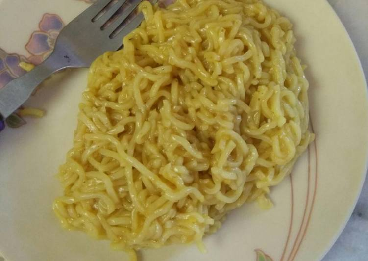

# How to cook Maggi noodles

Following is the procedure to cook Maggi noodles:

----
## Step 1: Boil Water
Boil two cups of water (total of 375mL) in a sauce pan for two minutes.

----
## Step 2: Dip Maggi Noodles
Break noodle cake and dip in the boiled water for another two or three minutes. 

----
## Step 3: Maggi Masala
Add Maggi masala while cooking.

> **Note**
>
> You can add few vegetables and extra masala according to taste.

----
## Step 4: Stir and Serve
Stir Maggi noodles for another three or four minutes and then serve it.

----
**Thanks for learning how to cook Maggi. Like and share you Maggi on [Maggi Lovers page](https://www.facebook.com/MaggiLovers/) on Facebook.**
